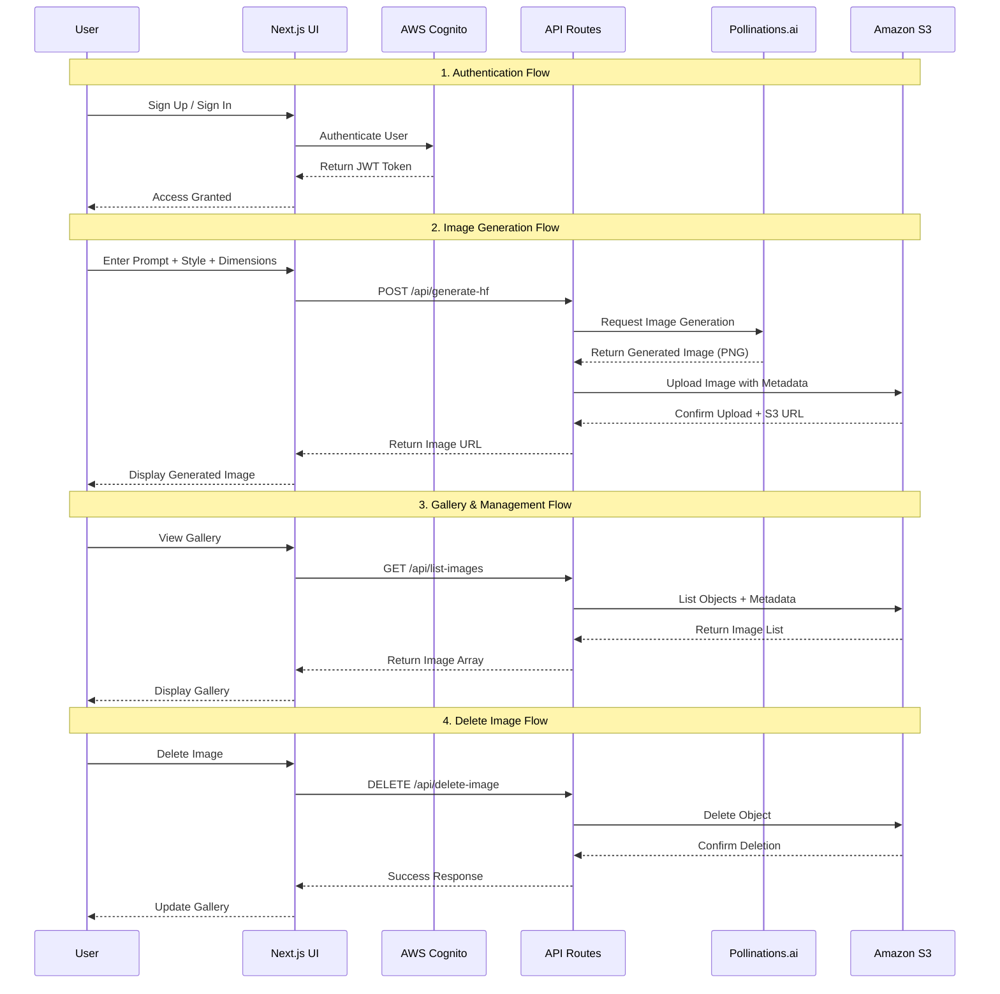
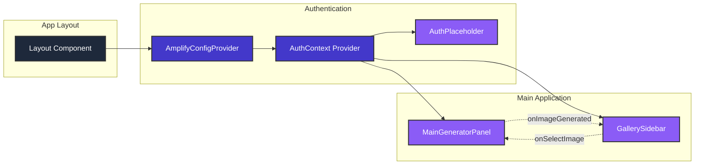
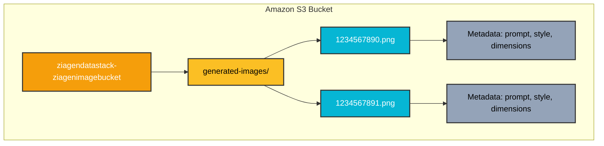
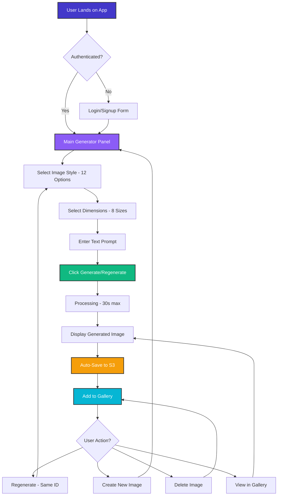
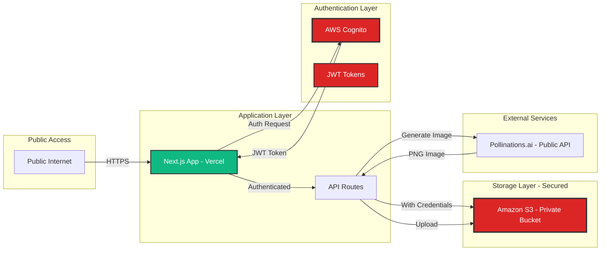
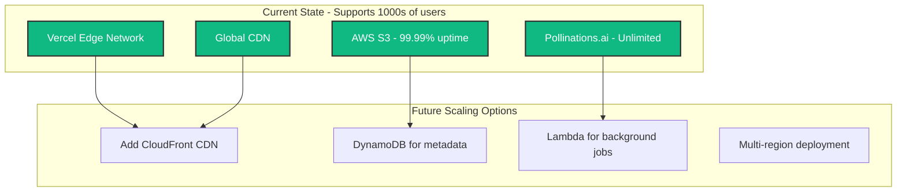

# 🏗️ ZiaGen Architecture Diagram

## System Architecture Overview

```mermaid
graph TB
    subgraph "Client Layer"
        A[Web Browser]
        A1[Mobile Device]
    end

    subgraph "Frontend - Next.js 16"
        B[Next.js App]
        B1[MainGeneratorPanel]
        B2[GallerySidebar]
        B3[AuthPlaceholder]
        B4[React Context - Auth]
    end

    subgraph "API Routes"
        C1[/api/generate-hf]
        C2[/api/list-images]
        C3[/api/delete-image]
    end

    subgraph "AWS Services"
        D1[Amazon Cognito]
        D2[Amazon S3]
        D3[API Gateway - Optional]
        D4[Lambda Functions - Optional]
    end

    subgraph "External APIs"
        E1[Pollinations.ai - Free AI]
    end

    A --> B
    A1 --> B
    B --> B1
    B --> B2
    B --> B3
    B --> B4

    B1 --> C1
    B2 --> C2
    B2 --> C3
    B3 --> D1
    B4 --> D1

    C1 --> E1
    C1 --> D2
    C2 --> D2
    C3 --> D2

    style A fill:#4338ca,stroke:#333,stroke-width:2px,color:#fff
    style A1 fill:#4338ca,stroke:#333,stroke-width:2px,color:#fff
    style B fill:#8b5cf6,stroke:#333,stroke-width:2px,color:#fff
    style C1 fill:#06b6d4,stroke:#333,stroke-width:2px,color:#fff
    style C2 fill:#06b6d4,stroke:#333,stroke-width:2px,color:#fff
    style C3 fill:#06b6d4,stroke:#333,stroke-width:2px,color:#fff
    style D1 fill:#f59e0b,stroke:#333,stroke-width:2px,color:#fff
    style D2 fill:#f59e0b,stroke:#333,stroke-width:2px,color:#fff
    style E1 fill:#10b981,stroke:#333,stroke-width:2px,color:#fff
```

---

## 📊 Detailed Data Flow



---

## 🔄 Component Architecture



---

## 🗄️ Data Storage Structure



---

## 🎨 Feature Flow Map



---

## 🔐 Security Architecture



---

## 💰 Cost Breakdown

| Service                | Usage                      | Cost                   |
| ---------------------- | -------------------------- | ---------------------- |
| **Pollinations.ai**    | Unlimited image generation | **$0.00** (Free!)      |
| **Vercel Hosting**     | 100GB bandwidth/month      | **$0.00** (Free tier)  |
| **AWS Cognito**        | Up to 50,000 MAU           | **$0.00** (Free tier)  |
| **AWS S3**             | Storage + requests         | **~$0.01-$1/month**    |
| **AWS API Gateway**    | Optional, minimal usage    | **~$0.00-$0.50/month** |
| **Total Monthly Cost** |                            | **~$0.01-$2.00** ✨    |

---

## 📈 Scalability



---

## 🎯 Technology Choices

| Component              | Technology      | Why?                                          |
| ---------------------- | --------------- | --------------------------------------------- |
| **Frontend Framework** | Next.js 16      | Best React framework, SSR, great DX           |
| **Styling**            | Tailwind CSS    | Utility-first, responsive, fast development   |
| **Authentication**     | AWS Cognito     | Enterprise-grade, scalable, secure            |
| **Storage**            | Amazon S3       | Reliable, cheap, scalable, global             |
| **AI Generation**      | Pollinations.ai | 100% free, unlimited, no API key needed       |
| **Hosting**            | Vercel          | Optimized for Next.js, free, fast, global CDN |
| **Type Safety**        | TypeScript      | Catch errors early, better DX, maintainable   |

---

**This architecture is built for scale, security, and minimal cost while delivering maximum value!** 🚀
